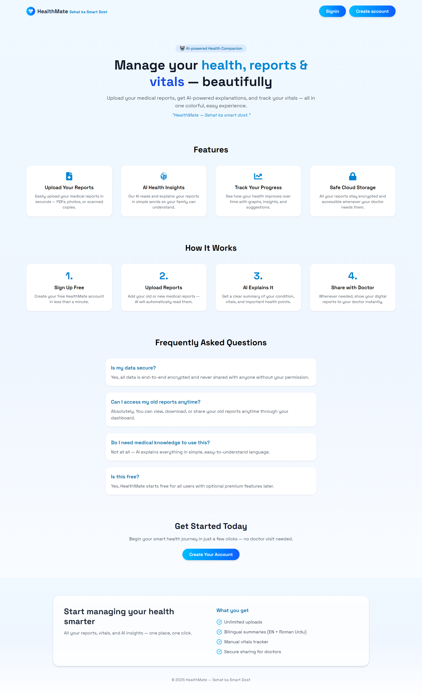
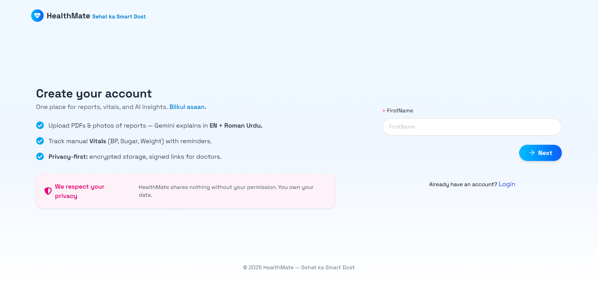
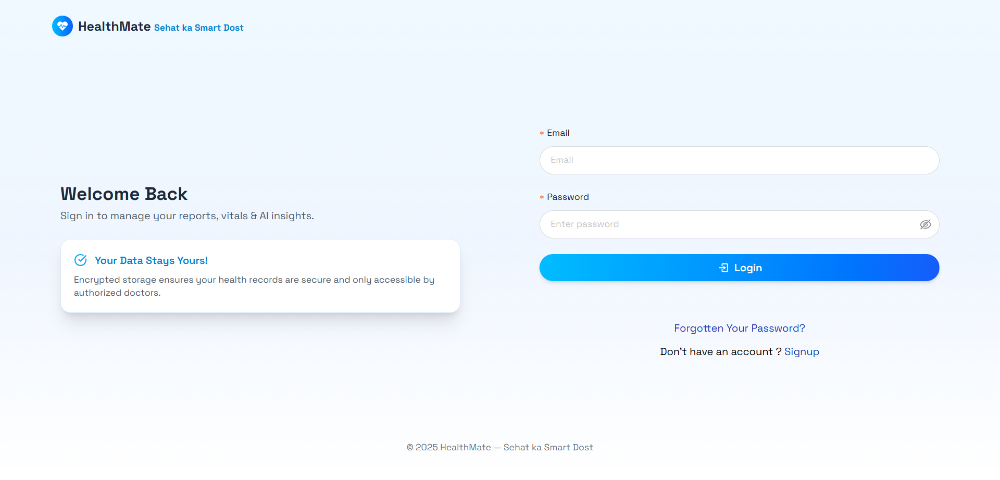
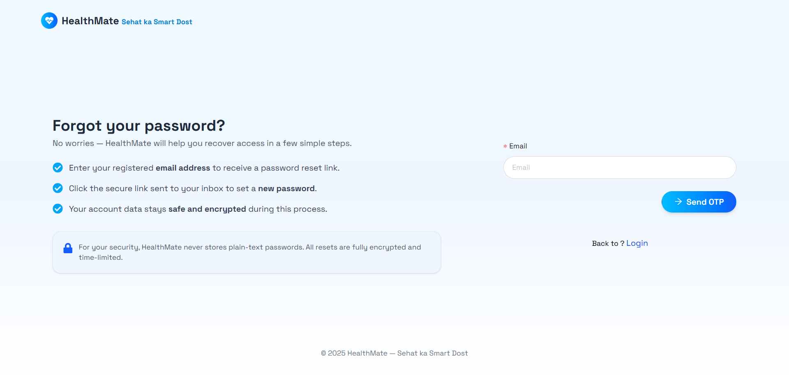
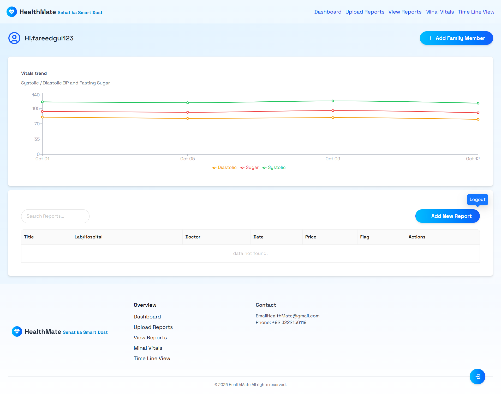
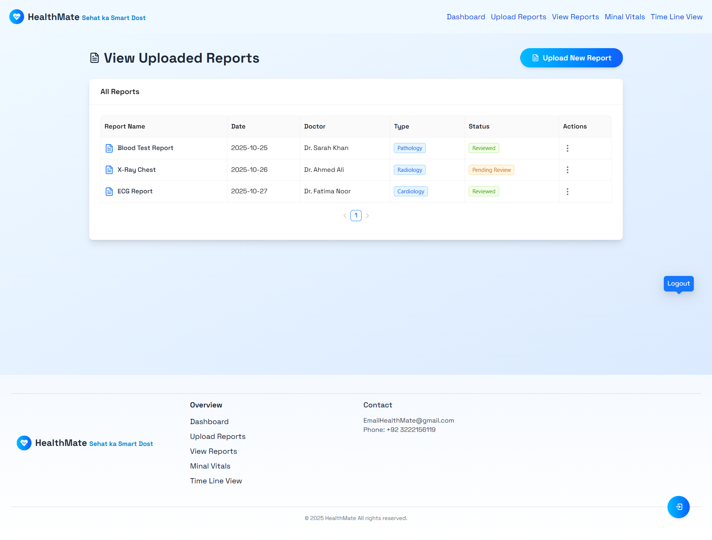
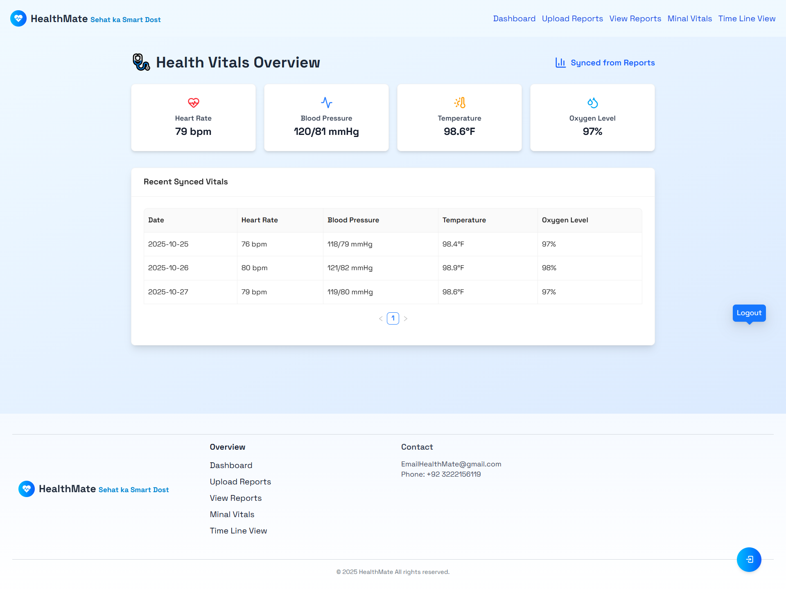
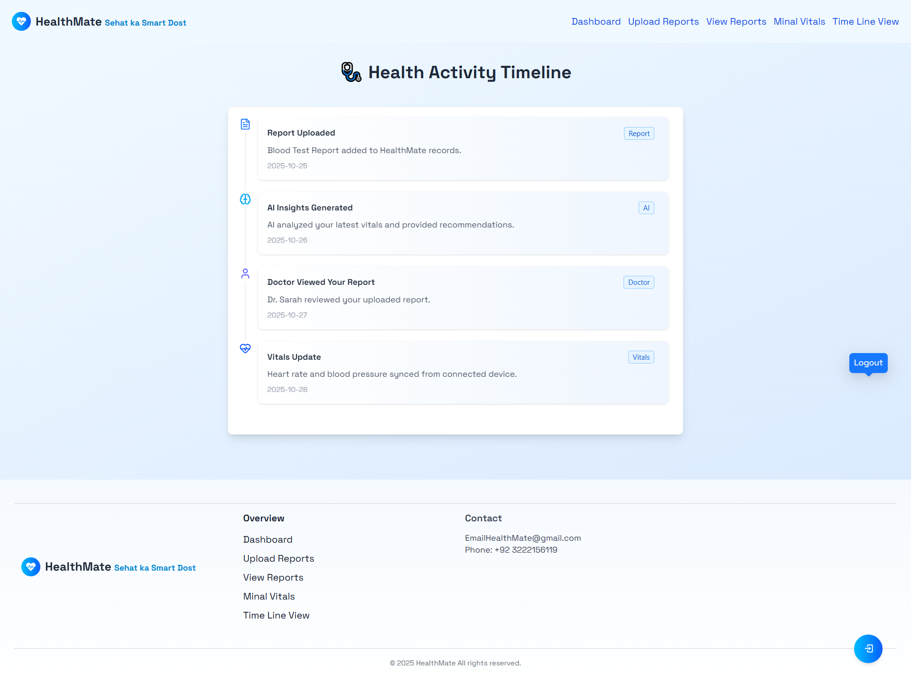

# 🩺 Health Mate - Full Stack Web Application

HealthMate is an intelligent MERN stack web application that allows users to upload and analyze health reports using Gemini AI, and also chat with an integrated AI Health Assistant for instant feedback.

Built with React.js, Express.js, MongoDB, and Node.js, HealthMate combines smart AI insights with a beautiful, responsive interface.

---

## 🧩 Tech Stack (Technology Used)

### 🌐 Frontend

**React JS + Tailwind CSS + Ant Design + React Icons**

**Libraries:**

- `react` → Frontend framework for building UI.
- `react-router-dom` → Routing system for pages navigation.
- `axios` → API calls between frontend and backend.
- `antd` → Advanced UI components (buttons, forms, tables, modals).
- `react-icons` → Stylish icons for better UI look.
- `recharts` → Graphs & charts for data visualization.
- `sweetalert2` → Alert messages for better user interaction.
- `lucide-react` → Modern icons for dashboards.
- `@emotion/react & @emotion/styled` → Styling utilities.
- `@tailwindcss/vite` → Tailwind CSS setup for faster build.

---

### ⚙️ Backend

**Node JS + Express JS + MongoDB (via Mongoose)**

**Libraries:**

- `express` → Backend server framework.
- `dotenv` → Environment variables manage karne ke liye.
- `mongoose` → MongoDB connection & schema model creation.
- `mongodb` → Direct MongoDB driver support.
- `cors` → Cross-origin requests handle karne ke liye.
- `multer` & `multer-storage-cloudinary` → Image upload system with Cloudinary.
- `cloudinary` → Image hosting & media storage.
- `jsonwebtoken (JWT)` → Secure authentication system.
- `bcrypt` → Password hashing for strong security.
- `joi` → Input validation system.
- `nodemailer` → Email sending for OTP & verification.
- `@google/generative-ai` → AI-based future integrations (optional).
- `nodemon` → Development server auto-restart.

---

## 🔐 Authentication & Security Features

- **User Registration with Email OTP Verification**  
  Jab user register karega, uske Gmail par ek OTP send hoga using `nodemailer`. Jab tak OTP verify nahi karega, account activate nahi hoga.

- **Login Notification**  
  Login ke time user ke Gmail par ek alert mail send hota hai for login confirmation (security purpose).

- **Forgot Password (Advanced System)**  
  Agar user apna password bhool jata hai, tu OTP Gmail par send hota hai. OTP verify hone ke baad hi password change hota hai.  
  Is system se unauthorized access prevent hoti hai.

- **Password Hashing using `bcrypt`**  
  Har password encrypted form me database me store hota hai, plain text me nahi.

- **JWT Tokens for Session Management**  
  Har authenticated user ko ek token milta hai jo login session ko secure rakhta hai.

---

🚀 Live Links
🔹 Frontend GitHub Repository
👉 https://github.com/fareedgul735/Health-Mate.git

🔹 Frontend (Vercel)
👉 https://health-mate-two-sandy.vercel.app

🔹 Backend (Railway)
👉https://heatlh-mate-bk-production.up.railway.app

🔹 Backend GitHub Repository
👉 https://github.com/fareedgul735/Heatlh-Mate-BK.git

🧠 Features
✅ AI Report Analyzer (Gemini) — Upload lab reports and get intelligent health insights generated by Google’s Gemini AI. 💬 AI Chatbot Assistant — Chat with an integrated health assistant powered by AI for instant suggestions and explanations. 🧾 Secure File Uploads — Upload PDF or image reports safely with server-side processing. 🧍‍♂️ User Authentication — Secure login/signup with JWT tokens. 📊 MongoDB Integration — Store and manage user data efficiently. 🎨 Responsive Design — Built with Tailwind CSS for a smooth experience across all devices.

## Screen Shots

